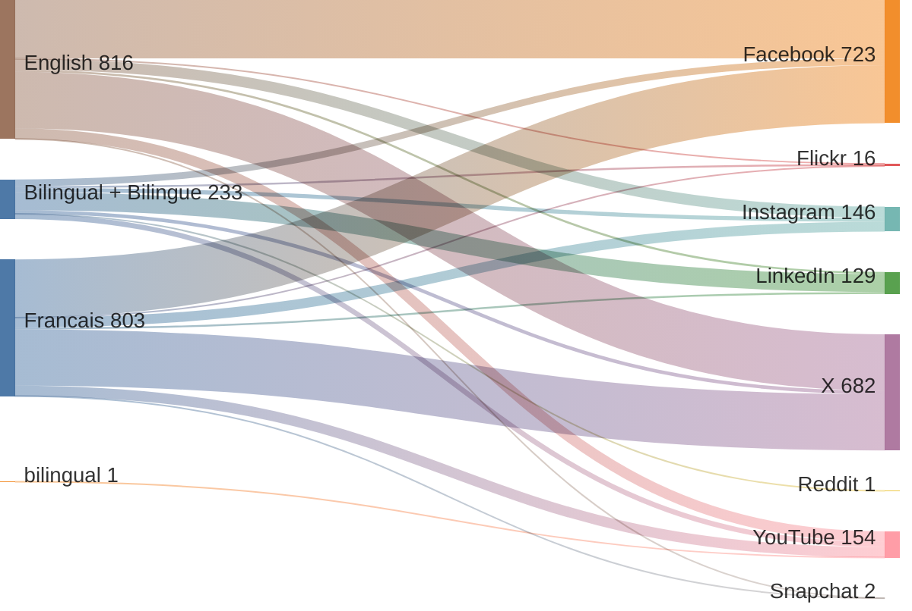
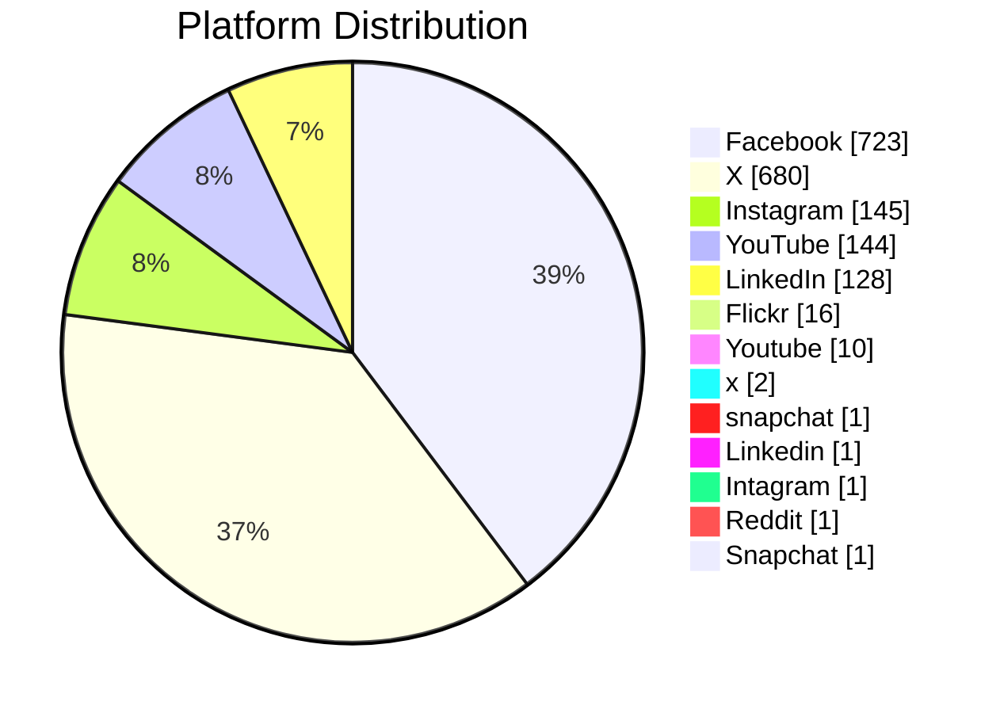
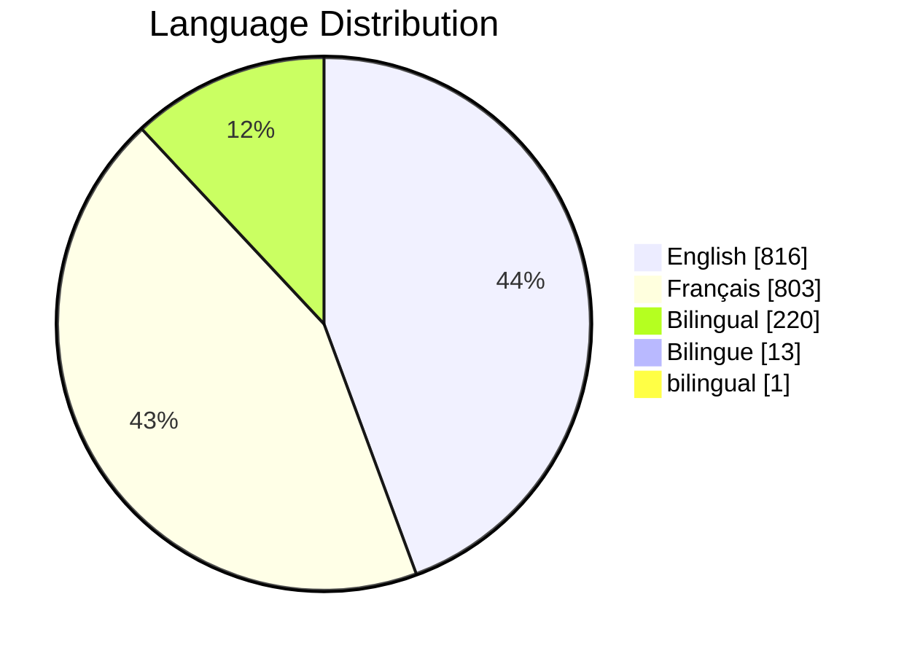
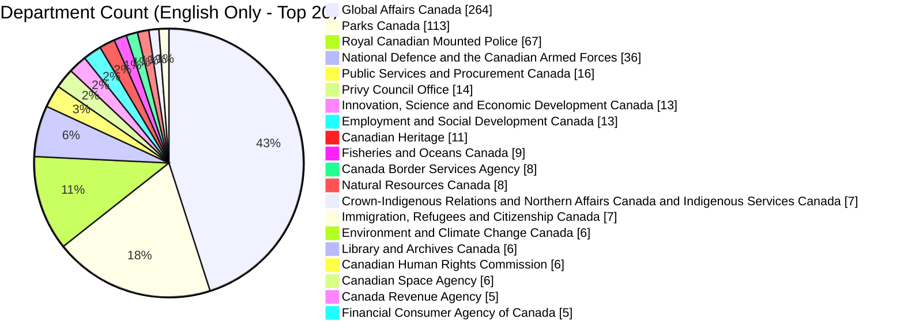
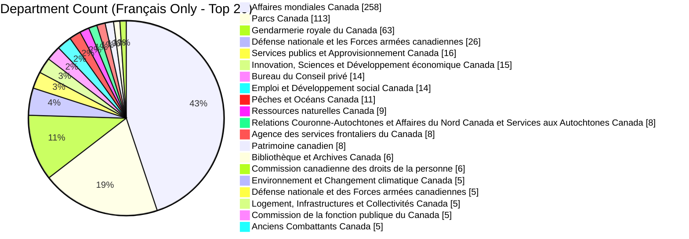
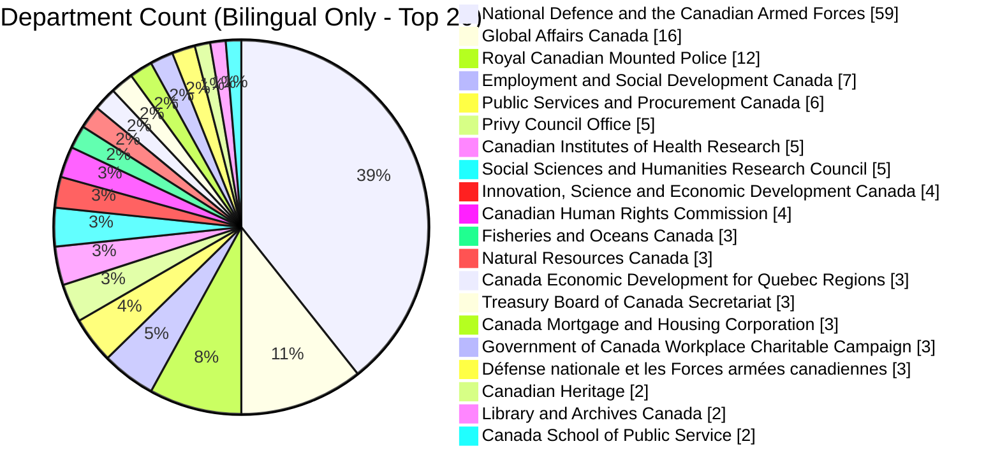

# GC-Socials
## Tracking the GC Offical Social Media Accounts Over Time

View the current list from https://www.canada.ca/en/social.html and https://www.canada.ca/fr/sociaux.html

View the number of official accounts by platform, by language over time

View the number of official accounts by department overtime

# Social Media Platform Overview

## Recent Account Changes (Last 14 Days)

### Accounts Added

| Account                                                       | Platform   | Department                        | Language   | URL                                                                    | Date Added   |
|:--------------------------------------------------------------|:-----------|:----------------------------------|:-----------|:-----------------------------------------------------------------------|:-------------|
| Stonewall / Headingley RCMP                                   | Facebook   | Manitoba East District RCMP       | English    | https://www.facebook.com/StonewallHeadingleyRCMP                       | 2026-02-12   |
| Steinbach RCMP                                                | Facebook   | Manitoba East District RCMP       | English    | https://www.facebook.com/SteinbachRCMP                                 | 2026-02-12   |
| Selkirk & Area RCMP                                           | Facebook   | Manitoba East District RCMP       | English    | https://www.facebook.com/SelkirkAreaRCMP/                              | 2026-02-12   |
| St. Pierre-Jolys RCMP                                         | Facebook   | Manitoba East District RCMP       | English    | https://www.facebook.com/StPierreJolysRCMP/                            | 2026-02-12   |
| Portage la Prairie RCMP                                       | Facebook   | Manitoba West District RCMP       | English    | https://www.facebook.com/PortageLaPrairieRCMP                          | 2026-02-12   |
| GRC de Flin Flon                                              | Facebook   | GRC du district nord du Manitoba  | Français   | https://www.facebook.com/GRCdeFlinFlon                                 | 2026-02-12   |
| GRC de Stonewall et Headingley                                | Facebook   | GRC du district Est du Manitoba   | Français   | https://www.facebook.com/GRCdeStonewalletHeadingley                    | 2026-02-12   |
| GRC de Steinbach                                              | Facebook   | GRC du district Est du Manitoba   | Français   | https://www.facebook.com/GRCdeSteinbach/                               | 2026-02-12   |
| GRC de Selkirk et region                                      | Facebook   | GRC du district Est du Manitoba   | Français   | https://www.facebook.com/GRCdeSelkirketRegion                          | 2026-02-12   |
| GRC de St-Pierre-Jolys                                        | Facebook   | GRC du district Est du Manitoba   | Français   | https://www.facebook.com/GRCdeStPierreJolys                            | 2026-02-12   |
| GRC de Portage La Prairie                                     | Facebook   | GRC du district ouest du Manitoba | Français   | https://www.facebook.com/GRCdePortageLaPrairie                         | 2026-02-12   |
| Canada.jpn                                                    | Instagram  | Global Affairs Canada             | Bilingual  | https://www.instagram.com/canada.jpn/                                  | 2026-02-11   |
| Saskatchewan RCMP | GRC en Saskatchewan                       | LinkedIn   | Royal Canadian Mounted Police     | Bilingual  | https://www.linkedin.com/company/saskatchewan-rcmp-grc-en-saskatchewan | 2026-02-10   |
| Codiac Regional Royal Canadian Mounted Police                 | Facebook   | Royal Canadian Mounted Police     | English    | https://www.facebook.com/codiacrcmp                                    | 2026-02-03   |
| Service régional de Codiac de la Gendarmerie royale du Canada | Facebook   | Gendarmerie royale du Canada      | Français   | https://www.facebook.com/grccodiac/                                    | 2026-02-03   |

### Accounts Deleted

_No accounts in the last 14 days._

# Social Media Platform Distribution

# Language Distribution

# Department Count (English Only - Top 20)

# Department Count (Français Only - Top 20)

# Department Count (Bilingual Only - Top 20)

