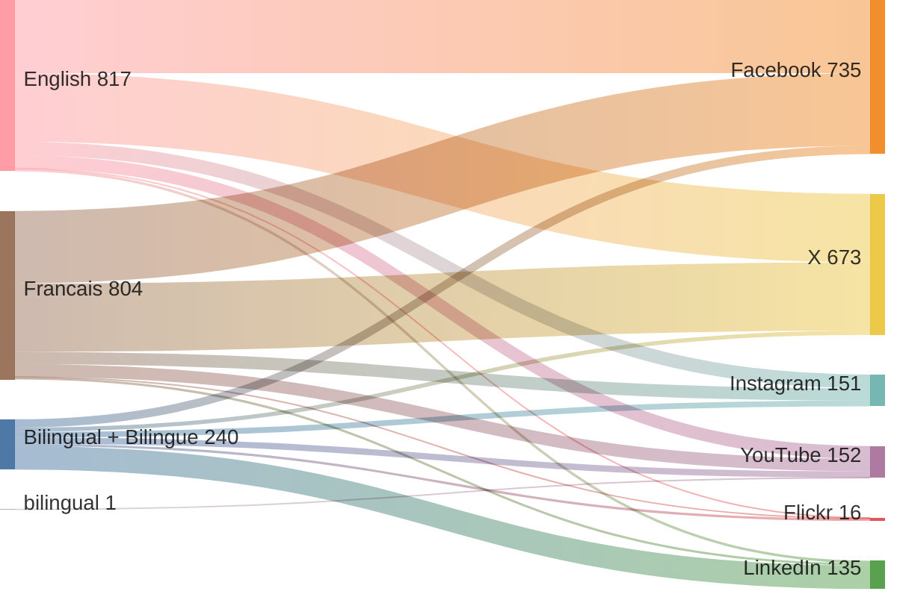
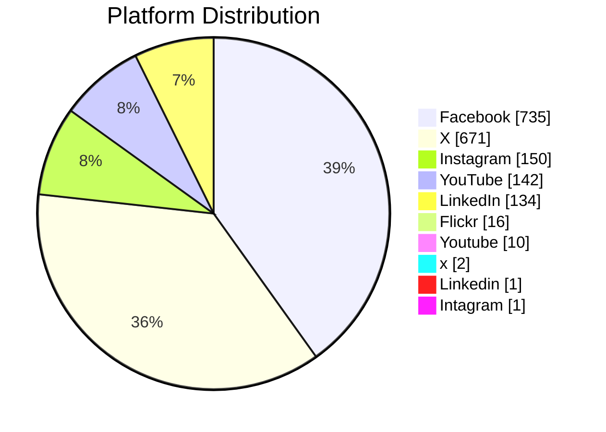
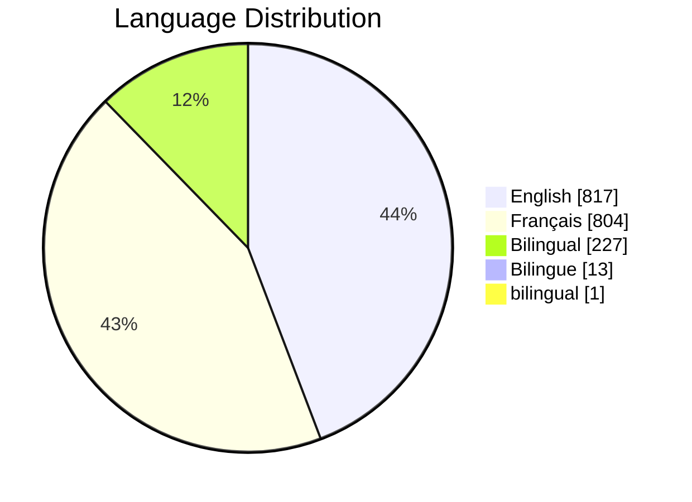
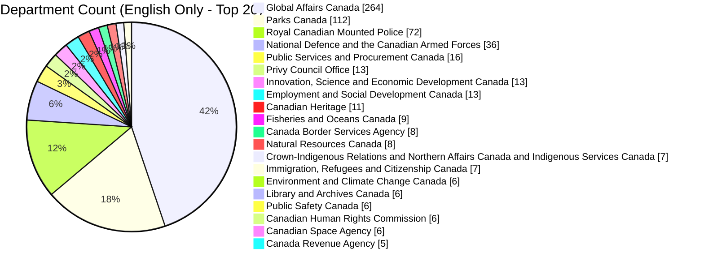
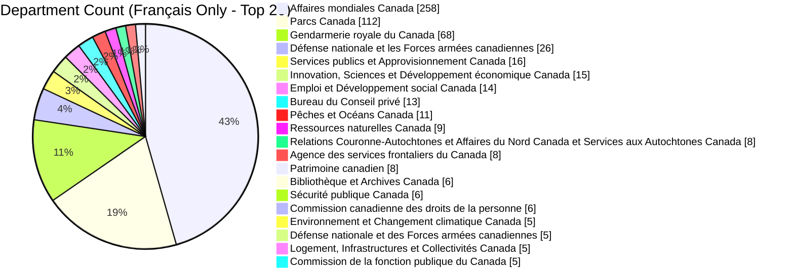
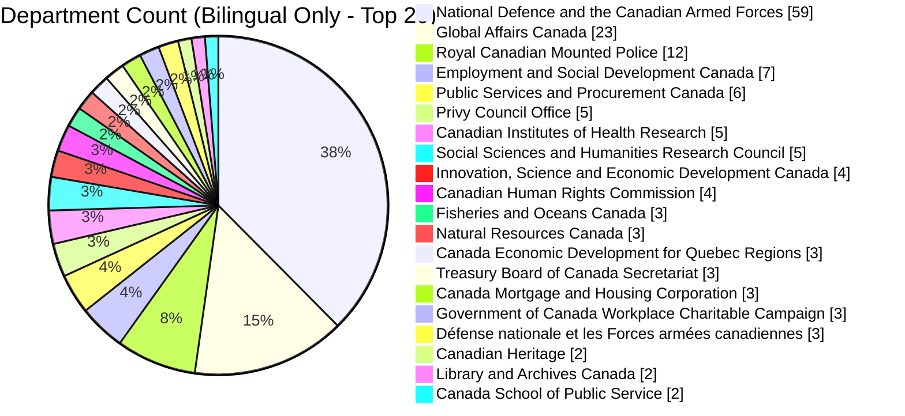

# GC-Socials
## Tracking the GC Offical Social Media Accounts Over Time

View the current list from https://www.canada.ca/en/social.html and https://www.canada.ca/fr/sociaux.html

View the number of official accounts by platform, by language over time

View the number of official accounts by department overtime

# Social Media Platform Overview

```mermaid
sankey-beta
  Bilingual + Bilingue,Facebook,40
  Bilingual + Bilingue,Flickr,11
  Bilingual + Bilingue,Instagram,27
  Bilingual + Bilingue,LinkedIn,112
  Bilingual + Bilingue,X,20
  Bilingual + Bilingue,YouTube,30
  English,Facebook,349
  English,Flickr,3
  English,Instagram,65
  English,LinkedIn,12
  English,X,327
  English,YouTube,61
  Francais,Facebook,346
  Francais,Flickr,2
  Francais,Instagram,59
  Francais,LinkedIn,11
  Francais,X,326
  Francais,YouTube,60
  bilingual,YouTube,1
```

## Recent Account Changes (Last 14 Days)

### Accounts Added

| Account                                                         | Platform   | Department                      | Language   | URL                                                    | Date Added   |
|:----------------------------------------------------------------|:-----------|:--------------------------------|:-----------|:-------------------------------------------------------|:-------------|
| Yellowhead & Spruce Plains RCMP                                 | Facebook   | Royal Canadian Mounted Police   | English    | https://www.facebook.com/YellowheadSprucePlainsRCMP/   | 2026-06-16   |
| GRC de Yellowhead & Spruce Plains                               | Facebook   | Gendarmerie royale du Canada    | Français   | https://www.facebook.com/GRCdeYellowheadSprucePlains   | 2026-06-16   |
| Our CFIA | Notre ACIA                                           | LinkedIn   | Canadian Food Inspection Agency | Bilingual  | https://www.linkedin.com/showcase/our-cfia-notre-acia/ | 2026-06-12   |
| Canada in Barbados and the OECS | Canada à la Barbade et l’OECO | LinkedIn   | Global Affairs Canada           | Bilingual  | https://www.linkedin.com/showcase/canhcbarbados/       | 2026-06-09   |
| Office of the Foreign Influence Commissioner of Canada          | Facebook   | Public Safety Canada            | English    | https://www.facebook.com/ForeignInfluenceCanada        | 2026-06-06   |
| OFICC | CIEC                                                    | LinkedIn   | Public Safety Canada            | Bilingual  | https://www.linkedin.com/company/oficc-ciec/           | 2026-06-06   |
| Commissariat à l'influence étrangère du Canada                  | Facebook   | Sécurité publique Canada        | Français   | https://www.facebook.com/InfluenceEtrangereCanada/     | 2026-06-06   |
| Embassy of Canada to Kuwait |Ambassade du Canada au Koweït      | LinkedIn   | Global Affairs Canada           | Bilingual  | https://www.linkedin.com/showcase/canembkw/            | 2026-06-04   |

### Accounts Deleted

| Account                          | Platform   | Department                          | Language   | URL                                                  | Date Deleted   |
|:---------------------------------|:-----------|:------------------------------------|:-----------|:-----------------------------------------------------|:---------------|
| Vice-première minister du Canada | X          | Bureau du Conseil privé             | Français   | https://twitter.com/VicePMduCanada                   | 2026-06-03     |
| @WAGE_FEGC                       | X          | Women and Gender Equality Canada    | English    | https://twitter.com/WAGE_FEGC                        | 2026-06-03     |
| Deputy Prime Minister of Canada  | X          | Privy Council Office                | English    | https://twitter.com/DeputyPM_Canada                  | 2026-06-03     |
| Deputy Prime Minister            | YouTube    | Privy Council Office                | English    | https://youtube.com/channel/UC8ncaYsMuN_smxVIErpKb1w | 2026-06-03     |
| @FEGC_WAGE                       | X          | Femmes et Égalité des genres Canada | Français   | https://twitter.com/FEGC_WAGE                        | 2026-06-03     |
| Vice-première ministre           | YouTube    | Bureau du Conseil privé             | Français   | https://youtube.com/channel/UCaqJQnLSDagarkLyd98IIWg | 2026-06-03     |

# Social Media Platform Distribution

```mermaid
pie showData title Platform Distribution
    "Facebook": 735
    "X": 671
    "Instagram": 150
    "YouTube": 142
    "LinkedIn": 134
    "Flickr": 16
    "Youtube": 10
    "x": 2
    "Linkedin": 1
    "Intagram": 1
```

# Language Distribution

```mermaid
pie showData title Language Distribution
    "English": 817
    "Français": 804
    "Bilingual": 227
    "Bilingue": 13
    "bilingual": 1
```

# Department Count (English Only - Top 20)

```mermaid
pie showData title Department Count (English Only - Top 20)
    "Global Affairs Canada": 264
    "Parks Canada": 112
    "Royal Canadian Mounted Police": 72
    "National Defence and the Canadian Armed Forces": 36
    "Public Services and Procurement Canada": 16
    "Privy Council Office": 13
    "Innovation, Science and Economic Development Canada": 13
    "Employment and Social Development Canada": 13
    "Canadian Heritage": 11
    "Fisheries and Oceans Canada": 9
    "Canada Border Services Agency": 8
    "Natural Resources Canada": 8
    "Crown-Indigenous Relations and Northern Affairs Canada and Indigenous Services Canada": 7
    "Immigration, Refugees and Citizenship Canada": 7
    "Environment and Climate Change Canada": 6
    "Library and Archives Canada": 6
    "Public Safety Canada": 6
    "Canadian Human Rights Commission": 6
    "Canadian Space Agency": 6
    "Canada Revenue Agency": 5
```

# Department Count (Français Only - Top 20)

```mermaid
pie showData title Department Count (Français Only - Top 20)
    "Affaires mondiales Canada": 258
    "Parcs Canada": 112
    "Gendarmerie royale du Canada": 68
    "Défense nationale et les Forces armées canadiennes": 26
    "Services publics et Approvisionnement Canada": 16
    "Innovation, Sciences et Développement économique Canada": 15
    "Emploi et Développement social Canada": 14
    "Bureau du Conseil privé": 13
    "Pêches et Océans Canada": 11
    "Ressources naturelles Canada": 9
    "Relations Couronne-Autochtones et Affaires du Nord Canada et Services aux Autochtones Canada": 8
    "Agence des services frontaliers du Canada": 8
    "Patrimoine canadien": 8
    "Bibliothèque et Archives Canada": 6
    "Sécurité publique Canada": 6
    "Commission canadienne des droits de la personne": 6
    "Environnement et Changement climatique Canada": 5
    "Défense nationale et des Forces armées canadiennes": 5
    "Logement, Infrastructures et Collectivités Canada": 5
    "Commission de la fonction publique du Canada": 5
```

# Department Count (Bilingual Only - Top 20)

```mermaid
pie showData title Department Count (Bilingual Only - Top 20)
    "National Defence and the Canadian Armed Forces": 59
    "Global Affairs Canada": 23
    "Royal Canadian Mounted Police": 12
    "Employment and Social Development Canada": 7
    "Public Services and Procurement Canada": 6
    "Privy Council Office": 5
    "Canadian Institutes of Health Research": 5
    "Social Sciences and Humanities Research Council": 5
    "Innovation, Science and Economic Development Canada": 4
    "Canadian Human Rights Commission": 4
    "Fisheries and Oceans Canada": 3
    "Natural Resources Canada": 3
    "Canada Economic Development for Quebec Regions": 3
    "Treasury Board of Canada Secretariat": 3
    "Canada Mortgage and Housing Corporation": 3
    "Government of Canada Workplace Charitable Campaign": 3
    "Défense nationale et les Forces armées canadiennes": 3
    "Canadian Heritage": 2
    "Library and Archives Canada": 2
    "Canada School of Public Service": 2
```