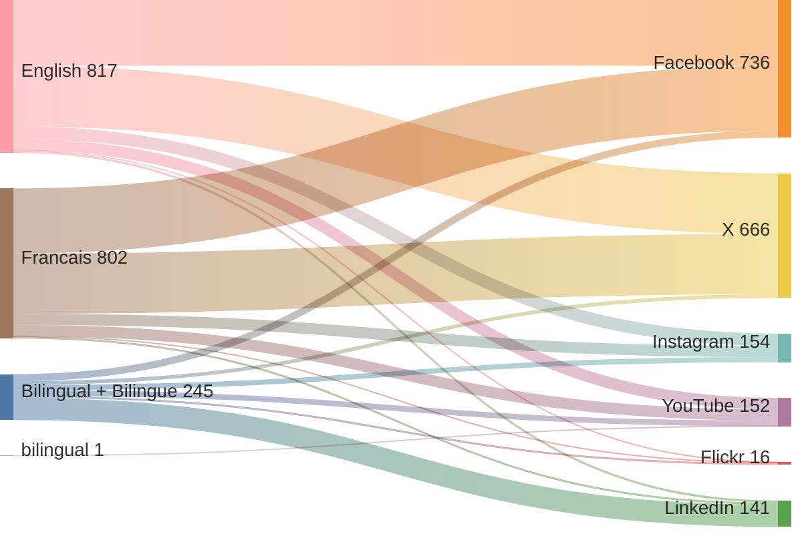
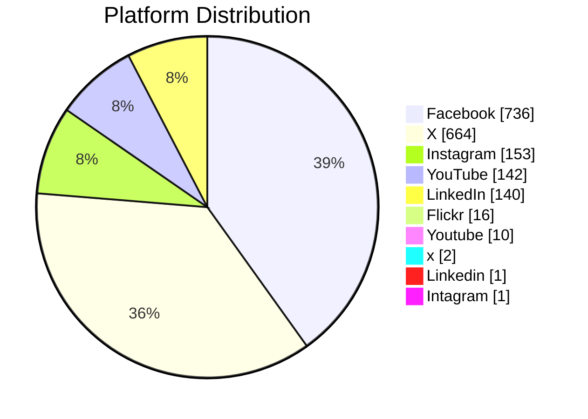
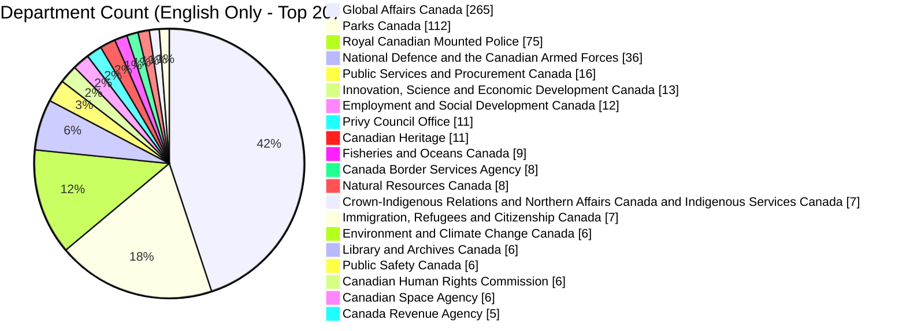
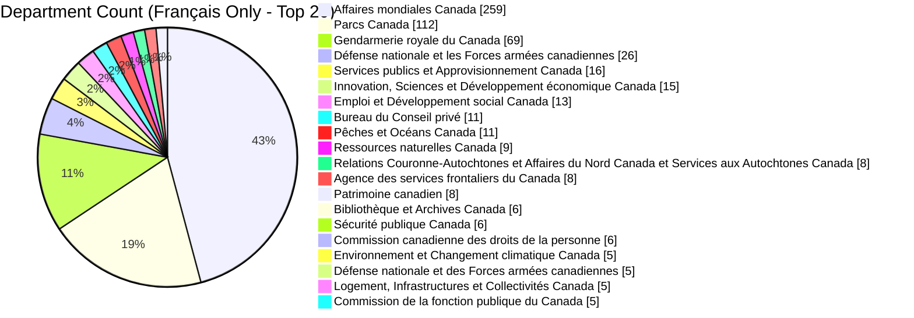
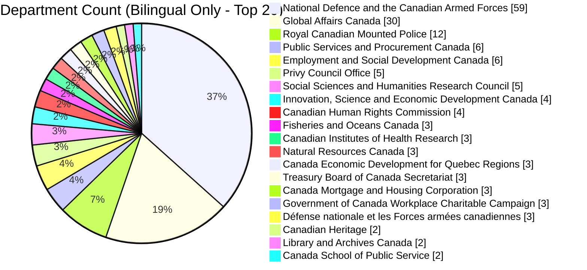

# GC-Socials
## Tracking the GC Offical Social Media Accounts Over Time

View the current list from https://www.canada.ca/en/social.html and https://www.canada.ca/fr/sociaux.html

View the number of official accounts by platform, by language over time

View the number of official accounts by department overtime

# Social Media Platform Overview

```mermaid
sankey-beta
  Bilingual + Bilingue,Facebook,38
  Bilingual + Bilingue,Flickr,11
  Bilingual + Bilingue,Instagram,28
  Bilingual + Bilingue,LinkedIn,118
  Bilingual + Bilingue,X,20
  Bilingual + Bilingue,YouTube,30
  English,Facebook,351
  English,Flickr,3
  English,Instagram,66
  English,LinkedIn,12
  English,X,324
  English,YouTube,61
  Francais,Facebook,347
  Francais,Flickr,2
  Francais,Instagram,60
  Francais,LinkedIn,11
  Francais,X,322
  Francais,YouTube,60
  bilingual,YouTube,1
```

## Recent Account Changes (Last 14 Days)

### Accounts Added

| Account                      | Platform   | Department                                             | Language   | URL                                               | Date Added   |
|:-----------------------------|:-----------|:-------------------------------------------------------|:-----------|:--------------------------------------------------|:-------------|
| Langley RCMP                 | Facebook   | Royal Canadian Mounted Police                          | English    | https://www.facebook.com/LangleyRCMP              | 2026-08-19   |
| @LangleyRCMP                 | X          | Royal Canadian Mounted Police                          | English    | https://x.com/LangleyRCMP                         | 2026-08-19   |
| pacifican_en                 | Instagram  | Pacific Economic Development Agency of Canada          | English    | https://www.instagram.com/pacifican_en/           | 2026-08-15   |
| Southwest Manitoba RCMP      | Facebook   | Royal Canadian Mounted Police                          | English    | https://www.facebook.com/SouthwestManitobaRCMP/   | 2026-08-15   |
| pacifican_fr                 | Instagram  | Agence de développement économique du Pacifique Canada | Français   | https://www.instagram.com/pacifican_fr/           | 2026-08-15   |
| GRC du Sud-Ouest du Manitoba | Facebook   | Gendarmerie royale du Canada                           | Français   | https://www.facebook.com/GRCduSudOuestduManitoba/ | 2026-08-15   |

### Accounts Deleted

_No accounts in the last 14 days._

# Social Media Platform Distribution

```mermaid
pie showData title Platform Distribution
    "Facebook": 736
    "X": 664
    "Instagram": 153
    "YouTube": 142
    "LinkedIn": 140
    "Flickr": 16
    "Youtube": 10
    "x": 2
    "Linkedin": 1
    "Intagram": 1
```

# Language Distribution

```mermaid
pie showData title Language Distribution
    "English": 817
    "Français": 802
    "Bilingual": 232
    "Bilingue": 13
    "bilingual": 1
```

# Department Count (English Only - Top 20)

```mermaid
pie showData title Department Count (English Only - Top 20)
    "Global Affairs Canada": 265
    "Parks Canada": 112
    "Royal Canadian Mounted Police": 75
    "National Defence and the Canadian Armed Forces": 36
    "Public Services and Procurement Canada": 16
    "Innovation, Science and Economic Development Canada": 13
    "Employment and Social Development Canada": 12
    "Privy Council Office": 11
    "Canadian Heritage": 11
    "Fisheries and Oceans Canada": 9
    "Canada Border Services Agency": 8
    "Natural Resources Canada": 8
    "Crown-Indigenous Relations and Northern Affairs Canada and Indigenous Services Canada": 7
    "Immigration, Refugees and Citizenship Canada": 7
    "Environment and Climate Change Canada": 6
    "Library and Archives Canada": 6
    "Public Safety Canada": 6
    "Canadian Human Rights Commission": 6
    "Canadian Space Agency": 6
    "Canada Revenue Agency": 5
```

# Department Count (Français Only - Top 20)

```mermaid
pie showData title Department Count (Français Only - Top 20)
    "Affaires mondiales Canada": 259
    "Parcs Canada": 112
    "Gendarmerie royale du Canada": 69
    "Défense nationale et les Forces armées canadiennes": 26
    "Services publics et Approvisionnement Canada": 16
    "Innovation, Sciences et Développement économique Canada": 15
    "Emploi et Développement social Canada": 13
    "Bureau du Conseil privé": 11
    "Pêches et Océans Canada": 11
    "Ressources naturelles Canada": 9
    "Relations Couronne-Autochtones et Affaires du Nord Canada et Services aux Autochtones Canada": 8
    "Agence des services frontaliers du Canada": 8
    "Patrimoine canadien": 8
    "Bibliothèque et Archives Canada": 6
    "Sécurité publique Canada": 6
    "Commission canadienne des droits de la personne": 6
    "Environnement et Changement climatique Canada": 5
    "Défense nationale et des Forces armées canadiennes": 5
    "Logement, Infrastructures et Collectivités Canada": 5
    "Commission de la fonction publique du Canada": 5
```

# Department Count (Bilingual Only - Top 20)

```mermaid
pie showData title Department Count (Bilingual Only - Top 20)
    "National Defence and the Canadian Armed Forces": 59
    "Global Affairs Canada": 30
    "Royal Canadian Mounted Police": 12
    "Public Services and Procurement Canada": 6
    "Employment and Social Development Canada": 6
    "Privy Council Office": 5
    "Social Sciences and Humanities Research Council": 5
    "Innovation, Science and Economic Development Canada": 4
    "Canadian Human Rights Commission": 4
    "Fisheries and Oceans Canada": 3
    "Canadian Institutes of Health Research": 3
    "Natural Resources Canada": 3
    "Canada Economic Development for Quebec Regions": 3
    "Treasury Board of Canada Secretariat": 3
    "Canada Mortgage and Housing Corporation": 3
    "Government of Canada Workplace Charitable Campaign": 3
    "Défense nationale et les Forces armées canadiennes": 3
    "Canadian Heritage": 2
    "Library and Archives Canada": 2
    "Canada School of Public Service": 2
```