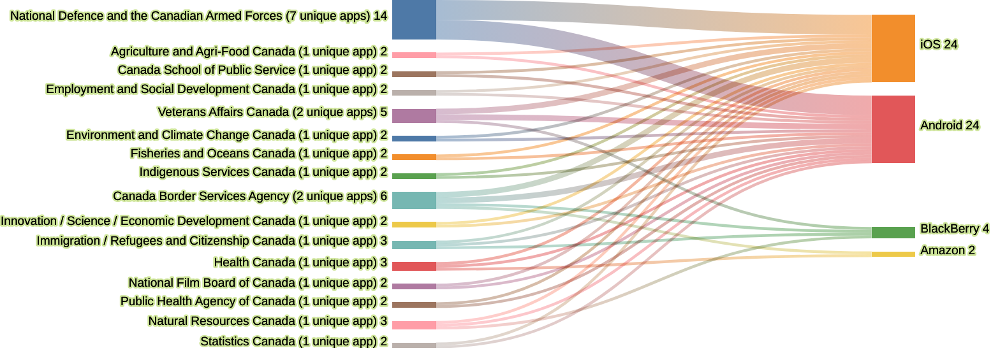
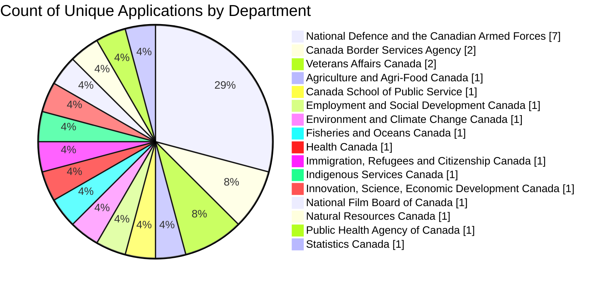
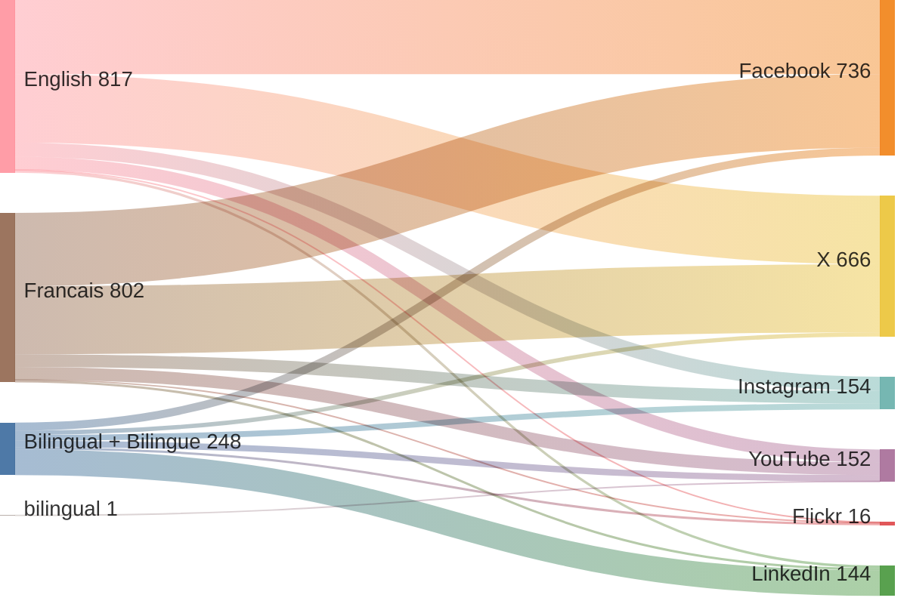
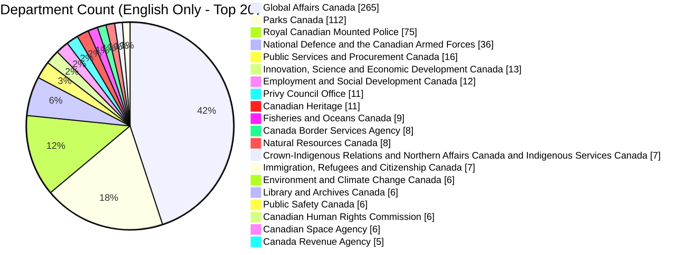
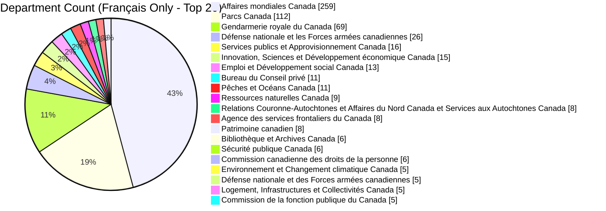
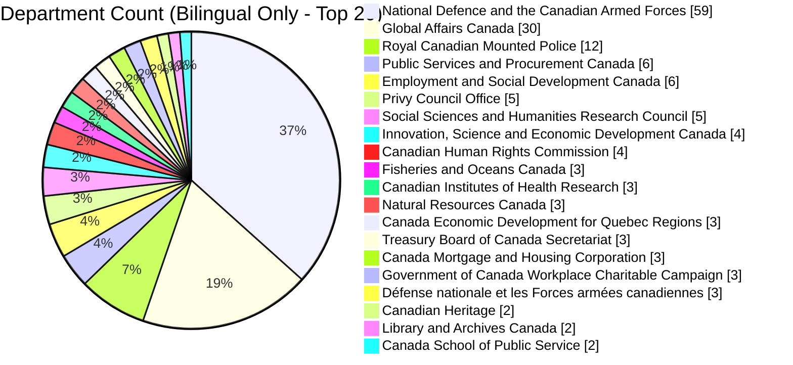

# GC-Socials
## Tracking the GC Offical Social Media Accounts Over Time

View the current list from https://www.canada.ca/en/social.html and https://www.canada.ca/fr/sociaux.html

View the number of official accounts by platform, by language over time

View the number of official accounts by department overtime

## Government of Canada mobile apps

The [`mobile-apps`](mobile-apps/) section contains a bilingual CSV of current Government of Canada mobile apps and an append-only history of apps removed from the Canada.ca feeds.

<!-- MOBILE_APPS_SANKEY_START -->
### Mobile apps by department and platform

Snapshot date: **2026-09-21**. Department labels show unique apps. Because one app can support several platforms, its outgoing platform counts may sum above that unique total.

[View the daily department and platform count history](mobile-apps/mobile_app_counts.csv).

#### Platform availability by department

```mermaid
---
config:
  sankey:
    showValues: true
    labelStyle: outlined
    nodeWidth: 50
    nodePadding: 0
    look: handDrawn
  theme: forest
---
sankey
  National Defence and the Canadian Armed Forces (7 unique apps),iOS,7
  National Defence and the Canadian Armed Forces (7 unique apps),Android,7
  Canada Border Services Agency (2 unique apps),iOS,2
  Canada Border Services Agency (2 unique apps),Android,2
  Canada Border Services Agency (2 unique apps),BlackBerry,1
  Canada Border Services Agency (2 unique apps),Amazon,1
  Veterans Affairs Canada (2 unique apps),iOS,2
  Veterans Affairs Canada (2 unique apps),Android,2
  Veterans Affairs Canada (2 unique apps),BlackBerry,1
  Agriculture and Agri-Food Canada (1 unique app),iOS,1
  Agriculture and Agri-Food Canada (1 unique app),Android,1
  Canada School of Public Service (1 unique app),iOS,1
  Canada School of Public Service (1 unique app),Android,1
  Employment and Social Development Canada (1 unique app),iOS,1
  Employment and Social Development Canada (1 unique app),Android,1
  Environment and Climate Change Canada (1 unique app),iOS,1
  Environment and Climate Change Canada (1 unique app),Android,1
  Fisheries and Oceans Canada (1 unique app),iOS,1
  Fisheries and Oceans Canada (1 unique app),Android,1
  Health Canada (1 unique app),iOS,1
  Health Canada (1 unique app),Android,1
  Health Canada (1 unique app),Amazon,1
  Immigration / Refugees and Citizenship Canada (1 unique app),iOS,1
  Immigration / Refugees and Citizenship Canada (1 unique app),Android,1
  Immigration / Refugees and Citizenship Canada (1 unique app),BlackBerry,1
  Indigenous Services Canada (1 unique app),iOS,1
  Indigenous Services Canada (1 unique app),Android,1
  Innovation / Science / Economic Development Canada (1 unique app),iOS,1
  Innovation / Science / Economic Development Canada (1 unique app),Android,1
  National Film Board of Canada (1 unique app),iOS,1
  National Film Board of Canada (1 unique app),Android,1
  Natural Resources Canada (1 unique app),iOS,1
  Natural Resources Canada (1 unique app),Android,1
  Natural Resources Canada (1 unique app),BlackBerry,1
  Public Health Agency of Canada (1 unique app),iOS,1
  Public Health Agency of Canada (1 unique app),Android,1
  Statistics Canada (1 unique app),iOS,1
  Statistics Canada (1 unique app),Android,1
```

#### Count of unique applications by department

```mermaid
pie showData title Count of Unique Applications by Department
  "National Defence and the Canadian Armed Forces" : 7
  "Canada Border Services Agency" : 2
  "Veterans Affairs Canada" : 2
  "Agriculture and Agri-Food Canada" : 1
  "Canada School of Public Service" : 1
  "Employment and Social Development Canada" : 1
  "Environment and Climate Change Canada" : 1
  "Fisheries and Oceans Canada" : 1
  "Health Canada" : 1
  "Immigration, Refugees and Citizenship Canada" : 1
  "Indigenous Services Canada" : 1
  "Innovation, Science, Economic Development Canada" : 1
  "National Film Board of Canada" : 1
  "Natural Resources Canada" : 1
  "Public Health Agency of Canada" : 1
  "Statistics Canada" : 1
```
<!-- MOBILE_APPS_SANKEY_END -->

# Social Media Platform Overview

```mermaid
sankey-beta
  Bilingual + Bilingue,Facebook,38
  Bilingual + Bilingue,Flickr,11
  Bilingual + Bilingue,Instagram,28
  Bilingual + Bilingue,LinkedIn,121
  Bilingual + Bilingue,X,20
  Bilingual + Bilingue,YouTube,30
  English,Facebook,351
  English,Flickr,3
  English,Instagram,66
  English,LinkedIn,12
  English,X,324
  English,YouTube,61
  Francais,Facebook,347
  Francais,Flickr,2
  Francais,Instagram,60
  Francais,LinkedIn,11
  Francais,X,322
  Francais,YouTube,60
  bilingual,YouTube,1
```

## Recent Account Changes (Last 14 Days)

### Accounts Added

| Account                                                          | Platform   | Department                     | Language   | URL                                                         | Date Added   |
|:-----------------------------------------------------------------|:-----------|:-------------------------------|:-----------|:------------------------------------------------------------|:-------------|
| Office des transports du Canada | Canadian Transportation Agency | LinkedIn   | Canadian Transportation Agency | Bilingual  | https://www.linkedin.com/company/otc-cta/?viewAsMember=true | 2026-09-09   |

### Accounts Deleted

_No accounts in the last 14 days._

# Social Media Platform Distribution

```mermaid
pie showData title Platform Distribution
    "Facebook": 736
    "X": 664
    "Instagram": 153
    "LinkedIn": 143
    "YouTube": 142
    "Flickr": 16
    "Youtube": 10
    "x": 2
    "Linkedin": 1
    "Intagram": 1
```

# Language Distribution

```mermaid
pie showData title Language Distribution
    "English": 817
    "Français": 802
    "Bilingual": 234
    "Bilingue": 14
    "bilingual": 1
```

# Department Count (English Only - Top 20)

```mermaid
pie showData title Department Count (English Only - Top 20)
    "Global Affairs Canada": 265
    "Parks Canada": 112
    "Royal Canadian Mounted Police": 75
    "National Defence and the Canadian Armed Forces": 36
    "Public Services and Procurement Canada": 16
    "Innovation, Science and Economic Development Canada": 13
    "Employment and Social Development Canada": 12
    "Privy Council Office": 11
    "Canadian Heritage": 11
    "Fisheries and Oceans Canada": 9
    "Canada Border Services Agency": 8
    "Natural Resources Canada": 8
    "Crown-Indigenous Relations and Northern Affairs Canada and Indigenous Services Canada": 7
    "Immigration, Refugees and Citizenship Canada": 7
    "Environment and Climate Change Canada": 6
    "Library and Archives Canada": 6
    "Public Safety Canada": 6
    "Canadian Human Rights Commission": 6
    "Canadian Space Agency": 6
    "Canada Revenue Agency": 5
```

# Department Count (Français Only - Top 20)

```mermaid
pie showData title Department Count (Français Only - Top 20)
    "Affaires mondiales Canada": 259
    "Parcs Canada": 112
    "Gendarmerie royale du Canada": 69
    "Défense nationale et les Forces armées canadiennes": 26
    "Services publics et Approvisionnement Canada": 16
    "Innovation, Sciences et Développement économique Canada": 15
    "Emploi et Développement social Canada": 13
    "Bureau du Conseil privé": 11
    "Pêches et Océans Canada": 11
    "Ressources naturelles Canada": 9
    "Relations Couronne-Autochtones et Affaires du Nord Canada et Services aux Autochtones Canada": 8
    "Agence des services frontaliers du Canada": 8
    "Patrimoine canadien": 8
    "Bibliothèque et Archives Canada": 6
    "Sécurité publique Canada": 6
    "Commission canadienne des droits de la personne": 6
    "Environnement et Changement climatique Canada": 5
    "Défense nationale et des Forces armées canadiennes": 5
    "Logement, Infrastructures et Collectivités Canada": 5
    "Commission de la fonction publique du Canada": 5
```

# Department Count (Bilingual Only - Top 20)

```mermaid
pie showData title Department Count (Bilingual Only - Top 20)
    "National Defence and the Canadian Armed Forces": 59
    "Global Affairs Canada": 30
    "Royal Canadian Mounted Police": 12
    "Public Services and Procurement Canada": 6
    "Employment and Social Development Canada": 6
    "Privy Council Office": 5
    "Social Sciences and Humanities Research Council": 5
    "Innovation, Science and Economic Development Canada": 4
    "Canadian Human Rights Commission": 4
    "Fisheries and Oceans Canada": 3
    "Canadian Institutes of Health Research": 3
    "Natural Resources Canada": 3
    "Canada Economic Development for Quebec Regions": 3
    "Treasury Board of Canada Secretariat": 3
    "Canada Mortgage and Housing Corporation": 3
    "Government of Canada Workplace Charitable Campaign": 3
    "Défense nationale et les Forces armées canadiennes": 3
    "Canadian Heritage": 2
    "Library and Archives Canada": 2
    "Canada School of Public Service": 2
```