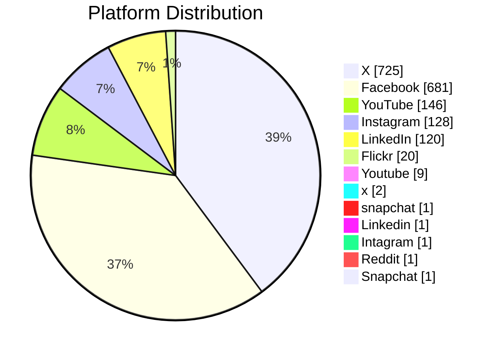
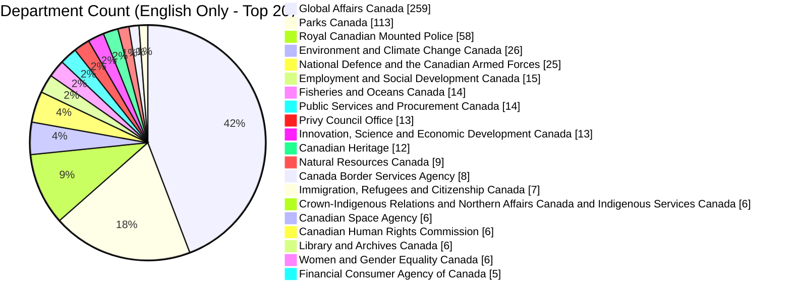
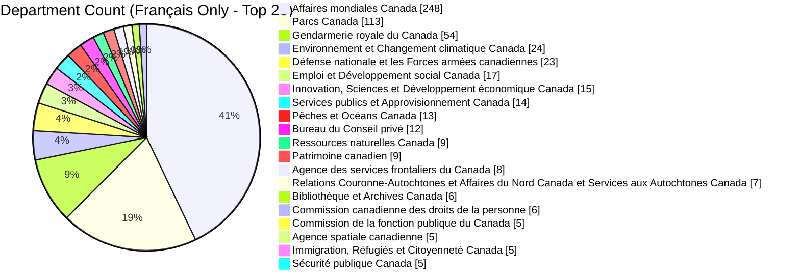
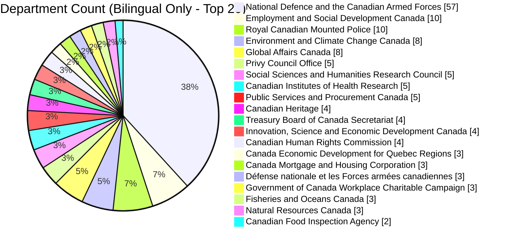

# GC-Socials
## Tracking the GC Offical Social Media Accounts Over Time

View the current list from https://www.canada.ca/en/social.html and https://www.canada.ca/fr/sociaux.html

View the number of official accounts by platform, by language over time

View the number of official accounts by department overtime

# Social Media Platform Overview

# Social Media Platform Distribution

# Language Distribution

# Department Count (English Only - Top 20)

# Department Count (Français Only - Top 20)

# Department Count (Bilingual Only - Top 20)

