# GC-Socials
## Tracking the GC Offical Social Media Accounts Overtime

View the current list from https://www.canada.ca/en/social.html and https://www.canada.ca/fr/sociaux.html

# Social Media Platform Distribution

# Language Distribution

```mermaid
pie showData title Language Distribution
    "English": 806
    "Français": 794
    "Bilingual": 212
    "Bilingue": 12
```

