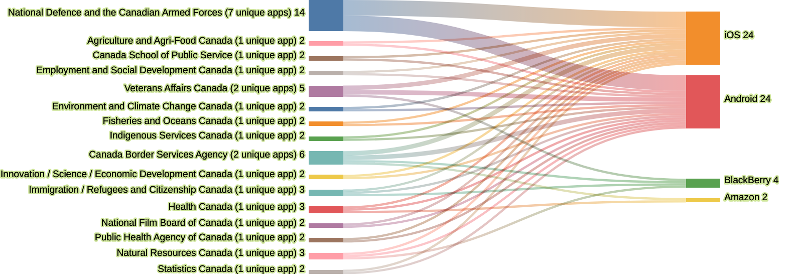
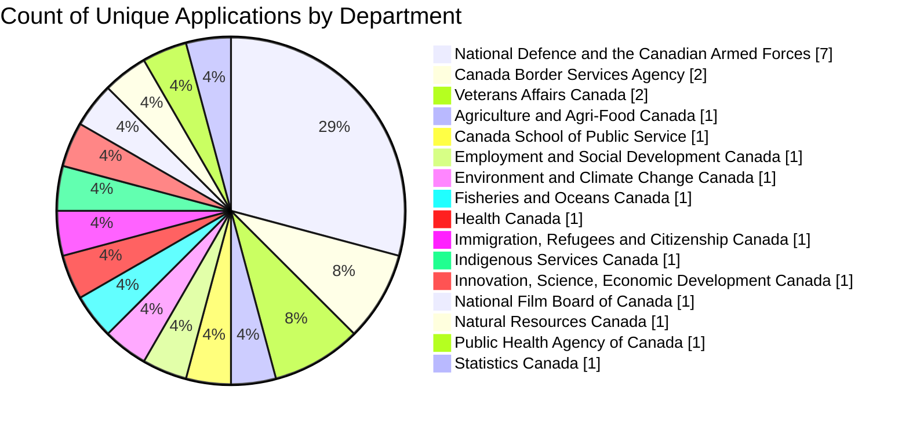

<!-- MOBILE_APPS_SANKEY_START -->
### Mobile apps by department and platform

Snapshot date: **2026-09-22**. Department labels show unique apps. Because one app can support several platforms, its outgoing platform counts may sum above that unique total.

[View the daily department and platform count history](mobile-apps/mobile_app_counts.csv).

#### Platform availability by department

#### Count of unique applications by department

<!-- MOBILE_APPS_SANKEY_END -->
